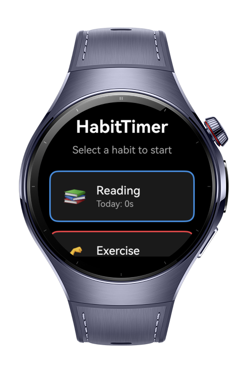
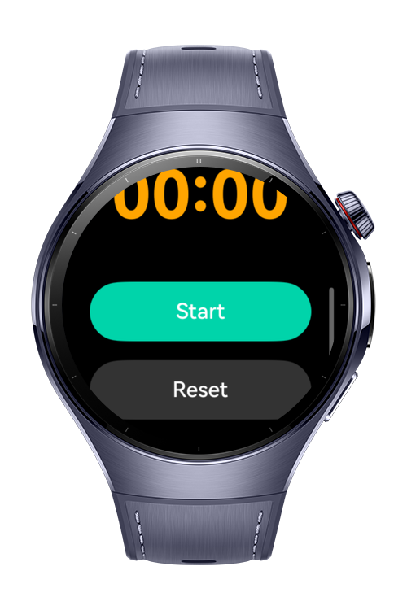

> **Note:** To access all shared projects, get information about environment setup, and view other guides, please visit [Explore-In-HMOS-Wearable Index](https://github.com/Explore-In-HMOS-Wearable/hmos-index).

# HabitTimer

This application demonstrates habit tracking with timer functionality for HarmonyOS wearable devices. It uses the
Preferences API for data persistence and provides a wearable-optimized interface for tracking time spent on daily habits
like reading, exercise, meditation, study, and practice.

# Preview

<div>
  
  
  
</div>

# Use Cases

* **Daily Habit Tracking:** Track time spent on important habits with automatic daily reset at midnight.
* **Focus Timer:** Use as a stopwatch to measure time spent on activities with start/pause/reset controls.
* **Progress Monitoring:** View daily and total time invested in each habit on your wrist.

# Tech Stack

* **Languages:** ArkTS
* **Frameworks:** HarmonyOS SDK 5.1.0 (API 18)
* **Tools:** DevEco Studio 5.1.0 or later
* **APIs:** `@kit.AbilityKit`, `@kit.ArkUI`, `@kit.ArkData` (Preferences API)

# Directory Structure

```
entry/src/main/ets/
|---entryability
|   |---EntryAbility.ets              // Application lifecycle management
|---pages
|   |---Index.ets                     // Main UI with timer and habit list
|---services
|   |---HabitService.ets              // Timer and habit business logic
|   |---PreferencesService.ets        // Data persistence wrapper
|---models
|   |---HabitModel.ets                // Data types and interfaces
```

# Constraints and Restrictions

## Supported Device

- HarmonyOS wearable devices supporting SDK 5.1.0 (API 18)
- Huawei Watch GT series (with ArkTS support)
- Huawei Watch D series (with ArkTS support)

## Limitations

* Timer pauses when app goes to background; must be manually restarted when returning to foreground.
* Habits are pre-configured in code; no UI to add/remove/edit habits.
* Uses Preferences API for storage; not suitable for extensive historical data tracking.

# License

HabitTimer is distributed under the terms of the MIT License.

See the [LICENSE](/LICENSE) for more information.
